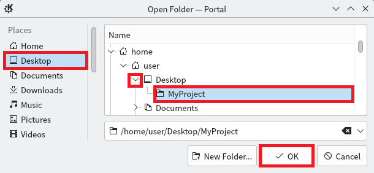
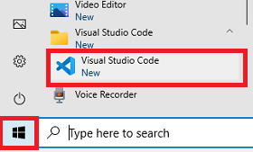
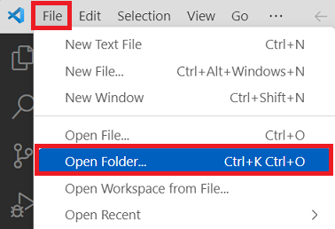
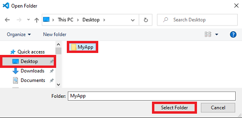
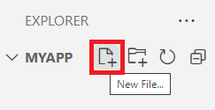
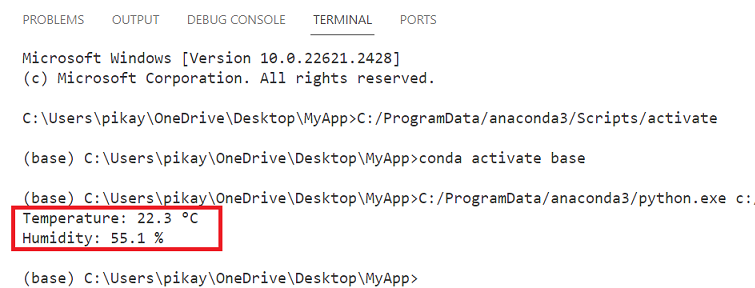
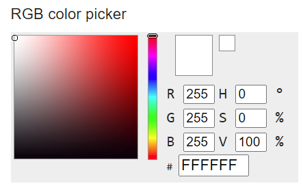
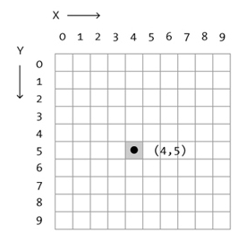
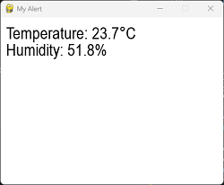

# Smart Alert System with Python

## Learning Outcomes

By finishing this session, you should be able to

- Play speech output to report sensor reading with `pyttsx3` library
- Control the LED that is attached to the single-board computer with General Purpose Input/Output (GPIO) pins using the `python-periphery` library
- Retrieve data from the MongoDB Atlas database and use a Graphical User Interface (GUI) to display data and alerts

## Github Page

- [https://github.com/scie1006-workshop/2024/workshop3.md](https://github.com/scie1006-workshop/2024/wrokshop3.md)

## Part 1: Getting Started

1. Power on the ROCK PI device and log in using the provided username and password.
2. Connect to the WIFI network.
   
   i.  Click the Networks icon in the taskbar, and then click the down arrrow next to BU-Standard and select Configure...

   

   <div style="page-break-after: always;"></div>
   ii.  Configure the connection as follows and then click Apply.

   

   iii.  Click the Connect button on BU-Standard and input your password to connect to the network.

   
4. Right-click the desktop and select Create New, followed by Folder.

   
5. Enter "MyProject" as the folder name, then click OK.

   

   <div style="page-break-after: always;"></div>
6. Launch Visual Studio Code by clicking the icon in the taskbar.

   
7. Choose Open Folder from the File menu.

   
8. After finding the MyProject folder on Desktop, click OK. If prompted, select Trust the authors.

   
9. In Explorer, click the New File... button to create a file called **`conditions.py`**.

   

   <div style="page-break-after: always;"></div>

## Part 2: Python Conditions and If Statements

If Statement is applied during the decision-making process.  It has a body of code that only executes when the if statement's condition is met. The optional else statement, which includes some code for the else condition, runs if the condition is false.

1. Try the following code in **`conditions.py`**.

   ```python
   a = 20
   b = 30

   if b > a:
       print(f'{b} is greater than {a}')
   ```

   In this case, the condition being checked is `b > a`, which checks if the value of `b` is greater than the value of `a`.

   Here are some commonly used conditions and logical operators in python:

   ```python
   if a < b:
      print(f'{a} is less than {b}')

   if a >= b:
      print(f'{a} is greater than or equal to {b}')

   if a <= b:
      print(f'{a} is less than or equal to {b}')

   if a == b:
      print(f'{a} is equal to {b}')

   if a != b:
      print(f'{a} is not equal to {b}')
   ```
2. The `else` statement is used in conjunction with an if statement to specify a block of code that should be executed when the condition of the if statement evaluates to False.

   ```python
   a = 20
   b = 30

   if a > b:
       print(f'{a} is greater than {b}')
   else:
       print(f'{a} is less than or equal to {b}')

   ```

## Part 3: Output Sensor Data with Speech

1. Get back the **`sensor.py`** you have completed in the previous session and save it to the MyProject folder.

   ```python
   from smbus2 import SMBus
   import time
   from pymongo import MongoClient
   import datetime

   # Your URI copied from MongoDB Atlas website
   # Replace <password> with the password you created for your database user
   uri = 'mongodb+srv://db:<password>@cluster0...:27017/'
   client = MongoClient(uri)
   db = client.database

   bus = SMBus(7)

   # The code block inside while True loop repeats continuously until 
   # you press Ctrl+C in the terminal
   while True:
      # trigger the sensor to do measurement
      bus.write_i2c_block_data(0x38, 0xAC, [0x33, 0x00]) 
      # wait for 0.5 seconds
      time.sleep(0.5)
      # read data from the sensor
      data = bus.read_i2c_block_data(0x38, 0x00, 8)

      temp = ((data[3] & 0x0F) << 16) | (data[4] << 8) | data[5]
      humi = ((data[1] << 16) | (data[2] << 8) | data[3]) >> 4

      temperature = temp / (2**20) * 200 - 50
      print(u'Temperature: {0:.1f}°C'.format(temperature))

      humidity = humi / (2**20) * 100
      print(u'Humidity: {0:.1f}%'.format(humidity))       

      record = {
         "sensor_id": 1,
         "temp": temperature,
         "humi": humidity,
         "date": datetime.datetime.now(),
      }

      db.sensors.insert_one(record)

      # wait for 60 seconds
      time.sleep(60) 
   ```

   <div style="page-break-after: always;"></div>

2. To play speech output, we need to import the `pyttsx3` library. Let's import the library at the top of the program.

   ```python
   import pyttsx3
   ```
3. Then, use the following program code to produce speech. Please add the following code **before** the `while` loop.

   ```python
   engine = pyttsx3.init()
   engine.say("Program started")
   engine.runAndWait()
   ```

   
4. To output the temperature value with speech, add the following code to the program right **after the print statement of the temperature value**, which is `print(u'Temperature: {0:.1f}°C'.format(temperature))`.

   ```python
   engine = pyttsx3.init()
   engine.say(u'Temperature is now {0:.1f}°'.format(temperature))
   engine.runAndWait()
   ```
5. **Exercise: Output humidity value with speech**

   Write code in the program to speak the humidity value out loud. It should say "Humidity is now XX%". You should put the code right **after the print statement of the humidity value**, which is `print(u'Humidity: {0:.1f}%'.format(humidity)) `.

   ```python
   # Exercise: Output humidity value with speech
   # Fill out the ... below
   engine = pyttsx3.init()
   engine.say(....)
   engine.runAndWait()
   ```

   <div style="page-break-after: always;"></div>

## Part 4: LED Alert System

In this section, we will learn how to make an LED alert system with Python. We will use the `python-periphery` library to control the LED connected to the ROCK Pi with GPIO.

### General Purpose Input/Output (GPIO)

General Purpose Input/Output (GPIO) pins are pins that can be used for input or output. They are usually used to connect to external devices such as sensors and actuators.

The LED is connected to the GPIO pin `146` for the Red channel and `150` for the Green channel.

1. Let's import the GPIO from the periphery library at the top of the program.

   ```python
   from periphery import GPIO
   ```
 

2. Add the following code to the program right **before** the `while` loop. It will turn on the Red LED for 3 seconds and then turn it off.

   ```python
   # set GPIO pin 146 as an output pin
   red_led = GPIO(146, "out")
   # turn on the red LED
   red_led.write(True)
   # wait for 3 seconds
   time.sleep(3)
   # turn off the red LED
   red_led.write(False)
   ```
3. **Exercise: Turning on and off the Green LED**

   Write code in the program to turn on the Green LED for 3 seconds and then turn it off **before** the `while` loop.

   ```python
   # Exercise: Turning on and off the Green LED
   # Fill out the ... below
   
   # set GPIO pin 150 as an output pin
   green_led = GPIO(..., "out")
   # turn on the green LED
   green_led.write(...)
   # wait for 3 seconds
   time.sleep(...)
   # turn off the green LED
   green_led.write(...)
   ```

   <div style="page-break-after: always;"></div>
5. Now, we have learned how to turn on and off the LEDs. Let's detect whether the temperature is too high in the program. Add the following code to the program right **before** the `time.sleep(60)` statement in the `while` loop. Mind the spacing.

   ```python
   if temperature > 28:
       print("Temperature is too high")
       # turn on the red LED
       red_led.write(True)
   else:
       print("Temperature is normal")
       # turn off the red LED
       red_led.write(False)
   ```

   When the temperature is too high, this code turns on the red LED, and when the temperature is normal, it turns the LED off.

   
## Part 5: Retrieving data from MongoDB

1. Right-click the desktop of the notebook computer, choose New, and then Folder to create a new folder called `MyApp`.
   *(Note: You can also do this part on the ROCK Pi.)*
   
    
   
2. Click the Start icon, and choose Visual Studio Code from the start menu.
   
   
   <div style="page-break-after: always;"></div>

3. Choose Open Folder from the File menu.

   
4. After finding the MyApp folder on Desktop, click Select Folder.

   
   
5. In Explorer, click the New File... button to create a file called **`gui.py`**.
   
   
   
6. First, we need to connect to the MongoDB database with the following code:

    ```python
    from pymongo import MongoClient
    import datetime

    # Your URI copied from the MongoDB Atlas website
    # Replace <password> with the password you created for your database user
    uri = 'mongodb+srv://db:<password>@cluster0...:27017/'
    client = MongoClient(uri)
    db = client.database
    collection = db.sensors      
    ```
7. To retrieve data from the MongoDB, we need to use the `find()` method. We sort the data by the date and get the last record for the latest data.

    ```python
    # Get the last record from the collection (sorted by "date")
    lastRecord = collection.find().sort("date", -1).limit(1)[0]    
    ```

8. The temperature value can be obtained by `lastRecord['temp']`. To print the result, we write:
   ```python
   print("Temperature: {0:.1f} °C".format(lastRecord['temp']))
   ```
   
9. **Exercise: Retrieving the humidity data from the cloud database**

   Write code in the program to retrieve the humidity data from MongoDB and print it out. The humidity value can be obtained by `lastRecord['humi']`.

   ```python
   # Exercise: Retrieving the humidity data from the cloud database
   # Fill out the ... below
   
   print("....".format(...))
   ```

   *Sample output*

   

   <div style="page-break-after: always;"></div>
  
## Part 6: Building a GUI Application with pygame

In this part, we will use the `pygame` library to create the GUI.

1. Let's import the library and initialize it at the top of the program.
   ```python
   import pygame 

   # initialize the pygame library and prepare it for use
   pygame.init() 
   ```
2. For a GUI application, we have to set the window size and name.
   ```python
   # set window size to 400x300 pixels
   window = pygame.display.set_mode((400, 300))   
   # set the window name
   pygame.display.set_caption('My Alert')   
   ```
3. Then, We create a font for text display and a clock to control the frame rate of the application.
   ```python   
   # create a font Arial with size 30 for text display
   font = pygame.font.SysFont("Arial", 30)
   # create a clock to control frame rate
   clock = pygame.time.Clock()
   ```

   

4. We use a while loop to continuously retrieve data from the database. Put the following code right **before** the line `lastRecord = collection.find().sort("date", -1).limit(1)[0]`, then put this line and the rest of the program inside the loop by adding a <kdb>Tab</kdb> at the beginning of each line.
   ```python

   # The code block inside while True loop repeats continuously until 
   # you press Ctrl+C in the terminal
   while True:
       # process any pending events to ensure the application remains responsive
       pygame.event.pump()
   ```
   
5. Let's set the background color to white before we draw the text at the end of the loop.
   ```python
       # fill the window with white color by RGB code (255, 255, 255)
       window.fill((255, 255, 255))
   ```
   See [RGB Color Codes Chart](https://www.rapidtables.com/web/color/RGB_Color.html) for color code.

   

   
   
6. To show text on the window, we first create a text surface and then draw it at a position. In pygame, positions are always supplied as an (X,Y) coordinate. This represents how many pixels to the right and how many pixels down the surface should be placed.

   

   ```python
       # create a text surface with black color, RGB code (0, 0, 0)
       tempText = font.render("Temperature: {0:.1f}°C".format(lastRecord['temp']), True, (0, 0, 0))    

       # draw the tempText surface at the position (10, 10)
       window.blit(tempText, (10, 10))
   
   ```

   <div style="page-break-after: always;"></div>

7. Finally, we update the display using `pygame.display.update()` to limit the frame rate to 1 frame per second using clock.tick(1).
   ```python
       # update the display window
       pygame.display.update()      
       # set the frame rate to 1 frame per second
       clock.tick(1) 
   ```
8. **Exercise: Displaying humidity value in the window**
   
   Draw the humidity data on the window. Make it under the temperature data. You should put the code **before** the line `pygame.display.update()`.

   ```python
       # Exercise: Displaying humidity value in the window
       # Fill out the ... below
   
       # create a text surface with black color, RGB code (0, 0, 0)
       humiText = font.render(..., True, (0, 0, 0)) 

       # draw the humiText surface at the position (10, 40)
       window.blit(...)
   ```   

   *Sample output*

   
   
   <div style="page-break-after: always;"></div>
   

## Part 7: Alerting the User with Colors

In this section, we will determine whether the temperature is within the normal range. The background color of the window will change to inform the user if the temperature rises above 28°C.

Let's **replace**  `window.fill((255, 255, 255))` with the following code:

```python
    if lastRecord['temp'] > 28:
       window.fill((255, 0, 0))  # red background
    else:
       window.fill((255, 255, 255)) # white background
```

The above code will change the background color to red if the temperature is higher than 28°C. Otherwise, it will change the background color to white.


## Demo
- You have to **demonstrate** your work to the instructor(s) before the end of the class.

## Discussion
Question: What smart solution can we build to reduce carbon emissions in Hong Kong? Justify your answer. (with no more than 500 words)
- Answer the discussion question in the Moodle submission box.

## Submission
You have to submit the following items to the Moodle submission box:
- The updated **`sensor.py`**
- **`gui.py`**
- Discussion Question

   <div style="page-break-after: always;"></div>

## References

- Check multiple conditions in if statement - Python - GeeksforGeeks. (2020, March 26). GeeksforGeeks. https://www.geeksforgeeks.org/check-multiple-conditions-in-if-statement-python/

- (n.d.). News New here?. https://www.pygame.org/
  
- Python conditions. (n.d.). W3Schools Online Web Tutorials. https://www.w3schools.com/python/python_conditions.asp
  
- Python, R. (2018, September 5). Conditional statements in Python – Real Python. Python Tutorials – Real Python. https://realpython.com/python-conditional-statements/

- Python conditions. (n.d.). W3Schools Online Web Tutorials. https://www.w3schools.com/python/python_conditions.asp

- Python, R. (2018, September 5). Conditional statements in Python – Real Python. Python Tutorials – Real Python. https://realpython.com/python-conditional-statements/

- Pyttsx3. (n.d.). PyPI. https://pypi.org/project/pyttsx3/
  
- Rock Pi 4 - the next generation RPI. (n.d.). Meet ROCK - Single Board Computers from Radxa. https://rockpi.org/rockpi4

- Tutorial. (n.d.). PyMongo 4.4.1 documentation. https://pymongo.readthedocs.io/en/stable/tutorial.html

- Vsergeev/Python-periphery: A pure Python 2/3 library for peripheral I/O (Gpio, led, PWM, SPI, I2C, MMIO, serial) in Linux. (n.d.). GitHub. https://github.com/vsergeev/python-periphery
